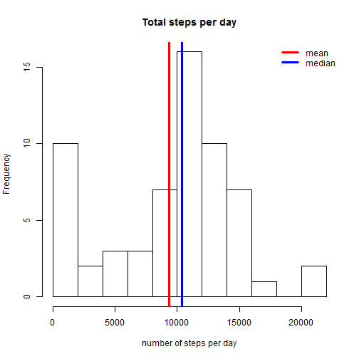
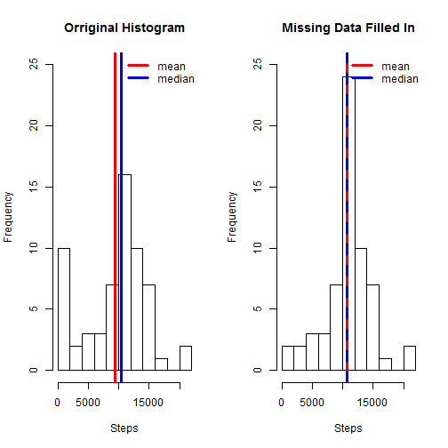
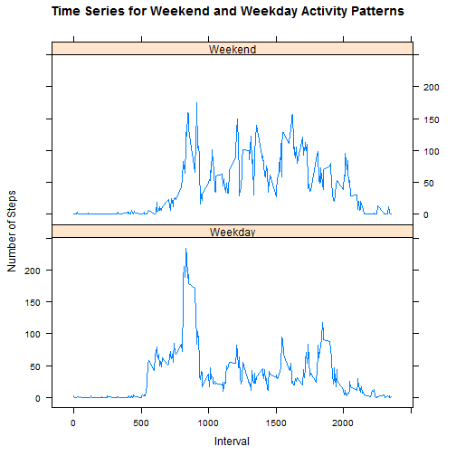

All code chunks visibility setting globally - 

opts_chunk$set(echo=TRUE)

This document describes the analysis of data from a personal activity monitoring device. The data consists of two months of data from an anonymous individual collected during the months of October and November, 2012 and include the number of steps taken in 5 minute intervals each day.

**Loading and preprocessing the data:**

First read the data csv file using read.csv function and load into activitydata variable. 
For this datafile which is located need to be set as working directory. 


```r
setwd("C:/my files/Coursera Learning/repo/RepData_PeerAssessment1/")
activitydata <- read.csv(unz("activity.zip", "activity.csv"), colClasses=c("integer", "Date", "integer"))
```

**Basic summary:**

Let's have look at summary of activity data 


```r
str(activitydata)
```

```
## 'data.frame':	17568 obs. of  3 variables:
##  $ steps   : int  NA NA NA NA NA NA NA NA NA NA ...
##  $ date    : Date, format: "2012-10-01" "2012-10-01" ...
##  $ interval: int  0 5 10 15 20 25 30 35 40 45 ...
```


```r
summary(activitydata)
```

```
##      steps            date               interval   
##  Min.   :  0.0   Min.   :2012-10-01   Min.   :   0  
##  1st Qu.:  0.0   1st Qu.:2012-10-16   1st Qu.: 589  
##  Median :  0.0   Median :2012-10-31   Median :1178  
##  Mean   : 37.4   Mean   :2012-10-31   Mean   :1178  
##  3rd Qu.: 12.0   3rd Qu.:2012-11-15   3rd Qu.:1766  
##  Max.   :806.0   Max.   :2012-11-30   Max.   :2355  
##  NA's   :2304
```

**What is mean total number of steps taken per day?**

First calculate the total number of steps each day by excluding the missing values and also calculation of mean totalsteps and median of total steps.

```r
total_steps <- tapply(activitydata$steps, activitydata$date, sum, na.rm=T)
meanstepday <- mean(total_steps); medianstepday <- median(total_steps)
```

`Calculate and report the mean and median total number of steps taken per day`

Mean of Total steps per each day


```r
meanstepday 
```

```
## [1] 9354
```

Median of Total steps per each day


```r
medianstepday 
```

```
## [1] 10395
```
`Make a histogram of the total number of steps taken each day`

Histogram of the total number of steps taken each day. 

The mean value of the total number of steps taken per day (9354.23) is highlighted by a vertical red line, the median (10395) by a vertical blue line.


```r
hist(total_steps, breaks=11, xlab="number of steps per day",main="Total steps per day")
abline(v=meanstepday, col="red", lwd=3); abline(v=medianstepday, col="blue", lwd=3)
legend(x="topright", legend=c("mean","median"), col=c("red","blue"), bty="n", lwd=3)
```

 

**What is the average daily activity pattern?**

Let's look at the average number of steps per 5 minute period, we can use the aggregate function to calculate the mean of each interval.

`Make a time series plot (i.e. type = "l") of the 5-minute interval (x-axis) and the average number of steps taken, averaged across all days (y-axis)`


```r
average_interval <- aggregate(steps ~ interval, activitydata, mean)
plot(average_interval, type = "l", xlab="Intervals", ylab="Average Steps per interval", main="Average steps per interval")
```

 

`Which 5-minute interval, on average across all the days in the dataset, contains the maximum number of steps?`

The maximum number of steps occurs in the 5-minutes interval starting at


```r
average_interval$interval[which.max(average_interval$steps)]
```

```
## [1] 835
```

**Imputing missing values:**

`Calculate and report the total number of missing values in the dataset (i.e. the total number of rows with NAs)`1

There are many missing values in the data set to be accurate


```r
sum(is.na(activitydata$steps))
```

```
## [1] 2304
```


```r
print(missing_dates <- unique(activitydata[is.na(activitydata$steps), ]$date))
```

```
## [1] "2012-10-01" "2012-10-08" "2012-11-01" "2012-11-04" "2012-11-09"
## [6] "2012-11-10" "2012-11-14" "2012-11-30"
```


```r
sapply(missing_dates, function(X) sum(is.na(activitydata[activitydata$date == X, ]$steps)))
```

```
## [1] 288 288 288 288 288 288 288 288
```

`Devise a strategy for filling in all of the missing values in the dataset. The strategy does not need to be sophisticated. For example, you could use the mean/median for that day, or the mean for that 5-minute interval,etc`

`Create a new dataset that is equal to the original dataset but with the missing data filled in.`


The daily activity pattern can be used to impute these missing values. For every missing value in the orignial data set the average number of steps in that 5-minutes interval is used and a new data frame `completed_data` is created. (NA replaced by mean in 5 min interval (average daily activity pattern)


```r
completed_data <- activitydata
for (X in missing_dates) completed_data[completed_data$date == X, ]$steps = average_interval$steps
completed_daily_steps <- with(completed_data, tapply(steps, date, sum, na.rm = T))
head(completed_daily_steps)
```

```
## 2012-10-01 2012-10-02 2012-10-03 2012-10-04 2012-10-05 2012-10-06 
##      10766        126      11352      12116      13294      15420
```

`Make a histogram of the total number of steps taken each day and Calculate and report the mean and median total number of steps taken per day. Do these values differ from the estimates from the first part of the assignment? What is the impact of imputing missing data on the estimates of the total daily number of steps?`

Now, using the completed data set with filled values, the total steps per day are again summed up and the mean and median are determined.


```r
meanstepday_cmp <- mean(completed_daily_steps); 
meanstepday_cmp
```

```
## [1] 10766
```


```r
medianstepday_cmp <- median(completed_daily_steps)
medianstepday_cmp
```

```
## [1] 10766
```

The total steps per each day are displayed as a histogram. The mean value of the total number of steps taken per day (10766.19) is highlighted by a vertical red line, the median (10766.19) by a vertical blue line. The mean and the median overlap. Both values have increased compared to the original data set. 


```r
par(mfrow = c(1, 2))
hist(total_steps, breaks = 10, xlab = "Steps", main = "Orriginal Histogram", ylim = c(0, 25))
abline(v=meanstepday, col="red", lwd=3); abline(v=medianstepday, col="blue", lwd=3)
legend(x="topright", legend=c("mean","median"), col=c("red","blue"), bty="n", lwd=3)
hist(completed_daily_steps, breaks = 10, xlab = "Steps", main = "Missing Data Filled In", ylim = c(0, 25))      
abline(v=meanstepday_cmp, col="red", lwd=3); abline(v=medianstepday_cmp, col="blue", lwd=3, lty=2)
legend(x="topright", legend=c("mean","median"), col=c("red","blue"), bty="n", lwd=3)
```

 

Due to filling the total sum of steps in these two month increases from 570608 to 656737.5


```r
sum(activitydata$steps, na.rm=TRUE)
```

```
## [1] 570608
```


```r
sum(completed_data$steps, na.rm=TRUE)
```

```
## [1] 656738
```

**Are there differences in activity patterns between weekdays and weekends?**

`Create a new factor variable in the dataset with two levels - "weekday" and "weekend" indicating whether a given date is a weekday or weekend day.`

In order to identify differences between weekdays and weekends a daily acitity pattern is generated for both types of days


```r
require(plyr)
activitydata$Weekend <- weekdays(activitydata$date) == "Saturday" | weekdays(activitydata$date) == "Sunday"
activitydata$Weekend <- factor(activitydata$Weekend, levels = c(F, T), labels = c("Weekday", "Weekend"))
```

`Make a panel plot containing a time series plot (i.e. type = "l") of the 5-minute interval (x-axis) and the average number of steps taken, averaged across all weekday days or weekend days (y-axis). The plot should look something like the following, which was creating using simulated data:`


```r
activity <- ddply(activitydata, .(interval, Weekend), summarize, steps = mean(steps, na.rm = T))
library(lattice)
xyplot(steps ~ interval | Weekend, activity, type = "l", layout = c(1, 2), ylab = "Number of Steps", xlab = "Interval", main = "Time Series for Weekend and Weekday Activity Patterns")
```

 
 
Morning activity is highest during weekdays, the overall activity is higher on weekends.
